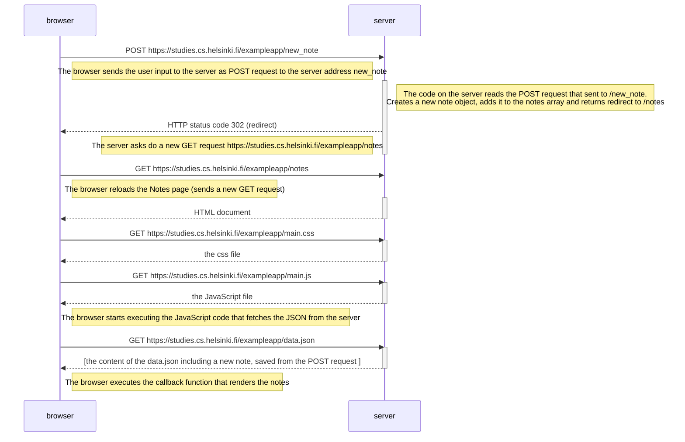

# MOOC-Full-Stack-open-2022

```mermaid
sequenceDiagram
    participant browser
    participant server
    
    browser->>server: POST https://studies.cs.helsinki.fi/exampleapp/new_note
    note right of browser: The browser sends the user input to the server as POST request to the server address new_note
    activate server    
    note right of server: The code on the server reads the POST request that sent to /new_note.<br>Creates a new note object, adds it to the notes array and returns redirect to /notes
    server-->>browser: HTTP status code 302 (redirect)
    note left of server: The server asks do a new GET request https://studies.cs.helsinki.fi/exampleapp/notes
    deactivate server
    
    browser->>server: GET https://studies.cs.helsinki.fi/exampleapp/notes
    note right of browser: The browser reloads the Notes page (sends a new GET request)
    
    activate server
    server-->>browser: HTML document
    deactivate server
    
    browser->>server: GET https://studies.cs.helsinki.fi/exampleapp/main.css
    activate server
    server-->>browser: the css file
    deactivate server
    
    browser->>server: GET https://studies.cs.helsinki.fi/exampleapp/main.js
    activate server
    server-->>browser: the JavaScript file
    deactivate server
    
    Note right of browser: The browser starts executing the JavaScript code that fetches the JSON from the server
    
    browser->>server: GET https://studies.cs.helsinki.fi/exampleapp/data.json
    activate server
    server-->>browser: [the content of the data.json including a new note, saved from the POST request ]
    deactivate server    

    Note right of browser: The browser executes the callback function that renders the notes 
 
```
