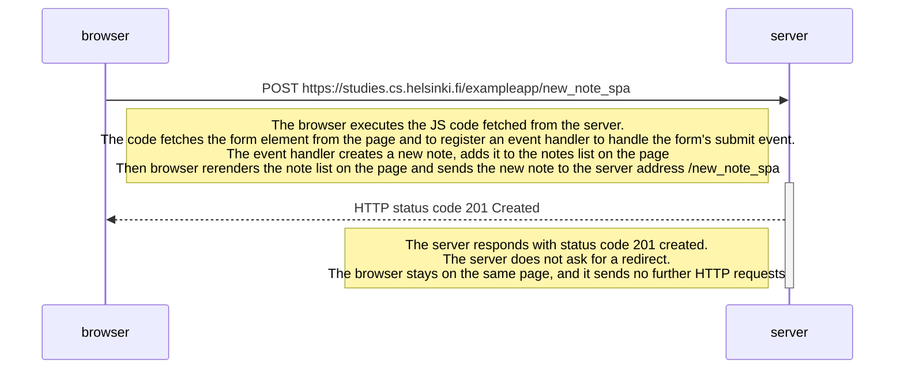

```mermaid

sequenceDiagram
    participant browser
    participant server
    
    browser->>server: POST https://studies.cs.helsinki.fi/exampleapp/new_note_spa
    note right of browser: The browser executes the JS code fetched from the server.<br>The code fetches the form element from the page and to register an event handler to handle the form's submit event.<br>The event handler creates a new note, adds it to the notes list on the page<br>Then browser rerenders the note list on the page and sends the new note to the server address /new_note_spa
       
    activate server    
    server-->>browser: HTTP status code 201 Created
    note left of server: The server responds with status code 201 created.<br> The server does not ask for a redirect.<br>The browser stays on the same page, and it sends no further HTTP requests
    deactivate server

```
